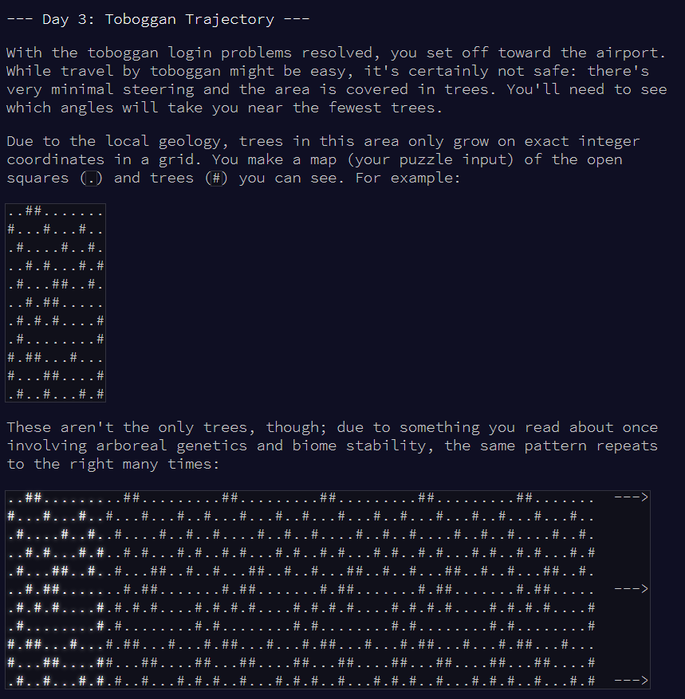

```{r setup, include = F}
library(dplyr)
library(stringr)
library(knitr)
library(kableExtra)
```

Tobogganing paths!




# Part 1

## aim

Starting at the top-left corner of your map and following a slope of right 3 and down 1, how many trees would you encounter?


```{r read-input}

# mini test set
test.v <- readLines("input_test.txt")
test.m <- matrix(unlist(strsplit(test.v, "")), ncol = 11, byrow = TRUE)
test.m

# full set
v <- readLines("input.txt")
n.cols <- nchar(v[1])
m <- matrix(unlist(strsplit(v, "")), ncol = n.cols, byrow = TRUE)
m[c(1:5), (1:10)]  # see first section

```

## define function

Loop through the rows, defining row and column indices and counting whether it's a tree or not.

NB. because the columns loop, need to use modulo [number of columns] to get the next column index.


```{r define-function}
# define function to count trees on path
matrix_count_trees <- function(m, r.step, c.step) {
  
  # get row and column limits
  r.lim <- nrow(m)
  c.lim <- ncol(m)
  
  # starting point
  r <- 1
  c <- 1
  
  # start counter at 0
  count.trees <- 0
  
  # loop until you get to end of rows
  while(r <= r.lim) {
    
    # get where we are
    # m[r, c]
    
    # is it a tree?
    is.tree <- as.numeric(m[r, c] == "#")
    
    # add tree counter
    count.trees <- count.trees + is.tree
    
    # move to the next position
    c <- c + c.step  # right three
    r <- r + r.step  # down one
    
    # REPEATING COLUMN PATTERN, so c = 12 needs to convert to c = 1.
    # use modulo c.lim [i.e. 11 for the test matrix], BUT R indexes from 1. So:
    # a. minus 1 (to pretend 0-indexing)
    # b. do modulo c.lim
    # c. add 1 (to get back to 1-indexing)
    c.m <- ((c - 1) %% c.lim) + 1
    
    # adjust c accordingly
    c <- c.m
    
  }
  
  return(count.trees)
  
}

```

## apply function

Test matrix

```{r test-m}
# try it on the test matrix
matrix_count_trees(test.m, r.step = 1, c.step = 3)  # 7 is correct!

```


```{r input-m}
# try it on the full input matrix
matrix_count_trees(m, r.step = 1, c.step = 3)

```


# Part 2

## aim


## use function

1. Right 1, down 1.
1. Right 3, down 1. (This is the slope you already checked.)
1. Right 5, down 1.
1. Right 7, down 1.
1. Right 1, down 2.

What do you get if you multiply together the numbers of trees encountered on each of these paths?

I ought to do this with a loop, but it's getting late and I need to do my actual work, so will do it manually for now and maybe come back later to make it more efficient!

```{r part-2}
# get numbers of trees for each path
n.1 <- matrix_count_trees(m, r.step = 1, c.step = 1)
n.2 <- matrix_count_trees(m, r.step = 1, c.step = 3)
n.3 <- matrix_count_trees(m, r.step = 1, c.step = 5)
n.4 <- matrix_count_trees(m, r.step = 1, c.step = 7)
n.5 <- matrix_count_trees(m, r.step = 2, c.step = 1)

# multiply them together
n.1 * n.2 * n.3 * n.4 * n.5

```


That's Day 3 done!

