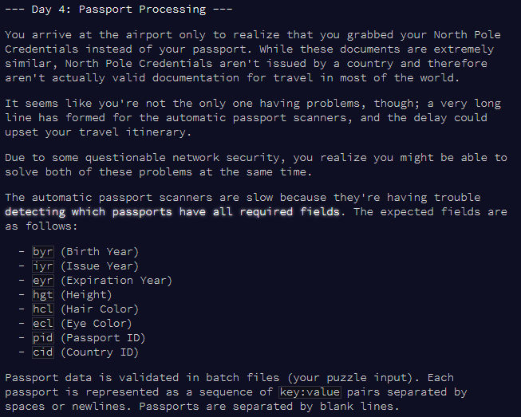
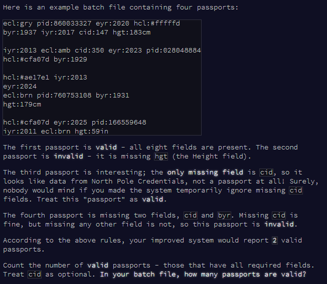

```{r setup, include = F}
library(dplyr)
library(stringr)
library(knitr)
library(kableExtra)
```

Passport processing






# Part 1

## aim

* Read passports in (separating lines are awkward)
* Count how many are valid (i.e. have all fields, but `cid` is optional)

## read and process data

Read lines:

```{r read-input}

# mini test set
test.v <- readLines("input_test.txt")

# full set
v <- readLines("input.txt")

```

Split into each passports (each passport can span multiple lines, but they are separated by empty lines)

```{r split-lines}
# v <- test.v  # for testing only

# find empty lines, and add a dummy for the end
ind.empty <- c(1, which(v == ""), (length(v)+1))

v.new <- c()

# loop to split
for (i in 1:(length(ind.empty)-1)) {
  
  # get data for this passport
  tmp <- v[ind.empty[i]:(ind.empty[i+1]-1)]
  tmp <- tmp[tmp != ""]  # remove empty strings
  tmp <- paste(tmp, collapse = " ")
  
  # add to results
  v.new <- c(v.new, tmp)
}

head(v.new)

```

Extract variables for each passport, add to a data frame.

Variables:

* byr (Birth Year)
* iyr (Issue Year)
* eyr (Expiration Year)
* hgt (Height)
* hcl (Hair Color)
* ecl (Eye Color)
* pid (Passport ID)
* cid (Country ID)

```{r get-vars}

vars <- c("byr", "iyr", "eyr", "hgt", "hcl", "ecl", "pid", "cid")

results <- data.frame(matrix(ncol = 8, nrow = 0))
colnames(results) <- vars

for (k in 1:length(v.new)) {
  # k <- 1
  t <- v.new[k]
  
  # temp results for this t
  tmp.res <- data.frame(matrix(ncol = 8, nrow = 1))
  colnames(tmp.res) <- vars
  
  # loop to extract vars
  for (var in vars) {
  # var <- vars[4]
  
  var.pat <- paste0(var, ":[:graph:]+")
  
  var.tmp <- str_extract(t, var.pat) %>%
    substr(., start = 5, stop = nchar(.)) # is NA if variable absent
  
  # add var.tmp to results
  tmp.res[1, grep(var, colnames(tmp.res))] <- var.tmp
  
  }
  
  # add tmp.res to results
  # tmp.res
  results <- rbind(results, tmp.res)
}

head(results)

```


## how many are valid?

Passports are valid if they have no NAs, OR an NA in the `cid` field only.

```{r add-valid}

# add valid column
results <- results %>%
  mutate(valid = case_when(
    (!is.na(byr)) & (!is.na(iyr)) & (!is.na(eyr)) & (!is.na(hgt)) & (!is.na(hcl)) & (!is.na(ecl)) & (!is.na(pid)) ~ TRUE,
    TRUE ~ FALSE
  ))

# summarise
results %>%
  group_by(valid) %>%
  count() %>%
  kable()

```


# Part 2 - add data validation

## apply rules

* byr (Birth Year) - four digits; at least 1920 and at most 2002.
* iyr (Issue Year) - four digits; at least 2010 and at most 2020.
* eyr (Expiration Year) - four digits; at least 2020 and at most 2030.
* hgt (Height) - a number followed by either cm or in:
    * If cm, the number must be at least 150 and at most 193.
    * If in, the number must be at least 59 and at most 76.
* hcl (Hair Color) - a # followed by exactly six characters 0-9 or a-f.
* ecl (Eye Color) - exactly one of: amb blu brn gry grn hzl oth.
* pid (Passport ID) - a nine-digit number, including leading zeroes.
* cid (Country ID) - ignored, missing or not.


```{r apply-validation}

df <- results

df <- df %>%
  # rule for byr: number between 1920 - 2002
  mutate(byr = case_when(
    (as.numeric(byr) >= 1920) & (as.numeric(byr) <= 2002) ~ as.numeric(byr),  # is valid
    TRUE ~ NA_real_  # not valid
  )) %>%
  # rule for iyr: number between 2010 - 2020
  mutate(iyr = case_when(
    (as.numeric(iyr) >= 2010) & (as.numeric(iyr) <= 2020) ~ as.numeric(iyr),  # is valid
    TRUE ~ NA_real_  # not valid
  )) %>%
  # rule for eyr: number between 2020 - 2030
  mutate(eyr = case_when(
    (as.numeric(eyr) >= 2020) & (as.numeric(eyr) <= 2030) ~ as.numeric(eyr),  # is valid
    TRUE ~ NA_real_  # not valid
  )) %>%
  # rule for hgt: extract number and units, check rule
  mutate(hgt.n = str_extract(hgt, "[:digit:]+"),
         hgt.u = str_extract(hgt, "[:lower:]+")) %>%
  mutate(hgt = case_when(
    (hgt.u == "cm") & (hgt.n >= 150) & (hgt.n <= 193) ~ hgt,
    (hgt.u == "in") & (hgt.n >= 59) & (hgt.n <= 76) ~ hgt,
    TRUE ~ NA_character_
  )) %>%
  # rule for hcl: # then 6 numbers/lowercase letters
  mutate(hcl = case_when(
    grepl("^#([a-z]|[0-9]){6}$", hcl) ~ hcl,
    TRUE ~ NA_character_
  )) %>%
  # rule for ecl: one of the options
  mutate(ecl = case_when(
    ecl %in% c("amb", "blu", "brn", "gry", "grn", "hzl", "oth") ~ ecl,
    TRUE ~ NA_character_
  )) %>%
  # rule for pid: 9 digits
  mutate(pid = case_when(
    grepl("^\\d{9}$", pid) ~ pid,  # 9 numeric digits
    TRUE ~ NA_character_
  ))

```

## how many are valid?

```{r get-valid-2}

# add valid.2 column
df <- df %>%
  mutate(valid.2 = case_when(
    (!is.na(byr)) & (!is.na(iyr)) & (!is.na(eyr)) & (!is.na(hgt)) & (!is.na(hcl)) & (!is.na(ecl)) & (!is.na(pid)) ~ TRUE,
    TRUE ~ FALSE
  ))

# summarise
df %>%
  group_by(valid.2) %>%
  count() %>%
  kable()

```

Day 4 done!


