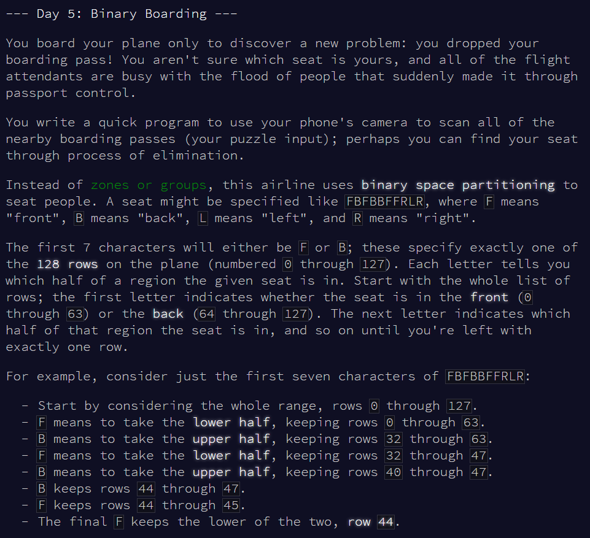
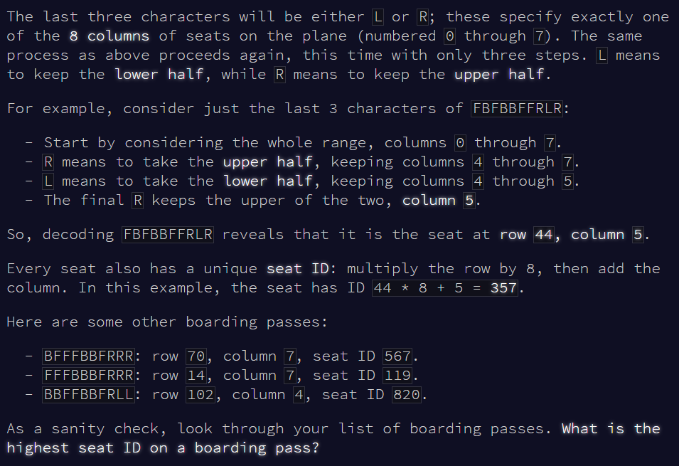
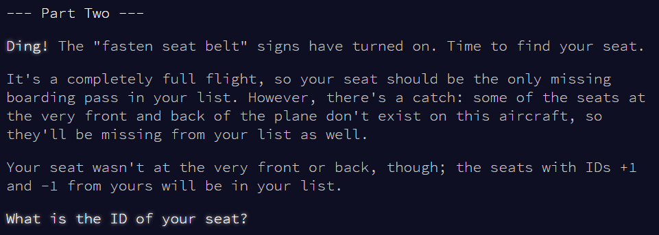

```{r setup, include = F}
library(dplyr)
library(stringr)
library(knitr)
library(kableExtra)
```







# Part 1


Read seat codes.

```{r read-input}

v.test <- readLines("input_test.txt")

v <- readLines("input.txt")

```


Convert seat codes to binary numbers, and work out what that number is in decimal to find the seat ID.

```{r to-binary}

# function for converting from F/B, R/L to binary number
convert_to_binary <- function(string) {
  output <- string %>%
  gsub("B", "1", .) %>% # back is higher numbers
  gsub("F", "0", .) %>%
  gsub("R", "1", .) %>% # right is higher numbers
  gsub("L", "0", .)
  return(output)
}
convert_to_binary_v <- Vectorize(convert_to_binary, vectorize.args = "string")

# apply function
v.bin <- convert_to_binary_v(v) %>%
  as.character()

# convert from binary to decimal
v.dec <- strtoi(v.bin, base = 2)

# highest and lowest seat numbers
min(v.dec)
max(v.dec)

```


The seat IDs on my plane range from `r min(v.dec)` to `r max(v.dec)`.


***

# Part 2



The lowest ID was 12, and the highest ID was 858. My ID is somewhere between 12 and 858, and is missing from the list I generated earlier. Find it.


```{r find-missing-id}

v.check <- c(12:858)
my.seat <- v.check[! v.check %in% v.dec]
my.seat

```


My seat ID is `r my.seat`.


Day 5 done!


