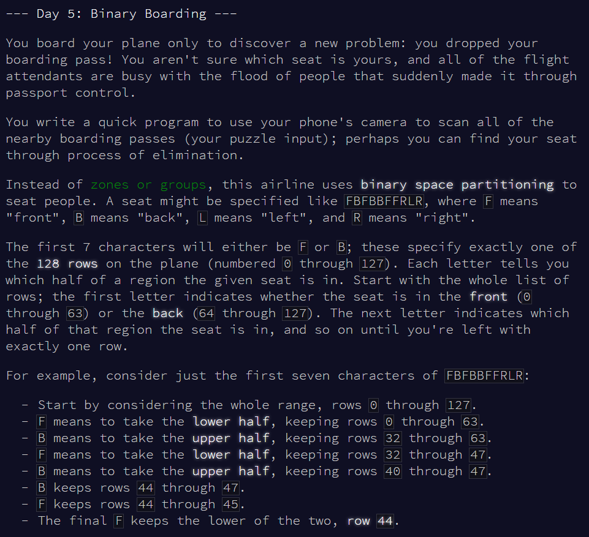
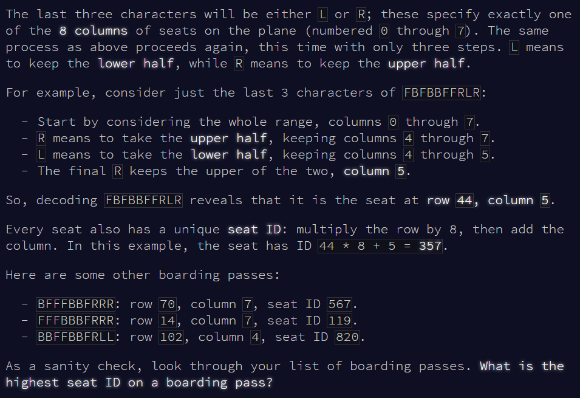

Advent of Code Day 05
================
Lizzie Pearmain
05 December, 2020

-   [Part 1](#part-1)
-   [Part 2](#part-2)





# Part 1

Read seat codes.

``` r
v.test <- readLines("input_test.txt")

v <- readLines("input.txt")
```

Convert seat codes to binary numbers, and work out what that number is in decimal to find the seat ID.

``` r
# function for converting from F/B, R/L to binary number
convert_to_binary <- function(string) {
  output <- string %>%
  gsub("B", "1", .) %>% # back is higher numbers
  gsub("F", "0", .) %>%
  gsub("R", "1", .) %>% # right is higher numbers
  gsub("L", "0", .)
  return(output)
}
convert_to_binary_v <- Vectorize(convert_to_binary, vectorize.args = "string")

# apply function
v.bin <- convert_to_binary_v(v) %>%
  as.character()

# convert from binary to decimal
v.dec <- strtoi(v.bin, base = 2)

# highest and lowest seat numbers
min(v.dec)
```

    ## [1] 12

``` r
max(v.dec)
```

    ## [1] 858

The seat IDs on my plane range from 12 to 858.

------------------------------------------------------------------------

# Part 2


The lowest ID was 12, and the highest ID was 858. My ID is somewhere between 12 and 858, and is missing from the list I generated earlier. Find it.

``` r
v.check <- c(12:858)
my.seat <- v.check[! v.check %in% v.dec]
my.seat
```

    ## [1] 557

My seat ID is 557.

Day 5 done!
