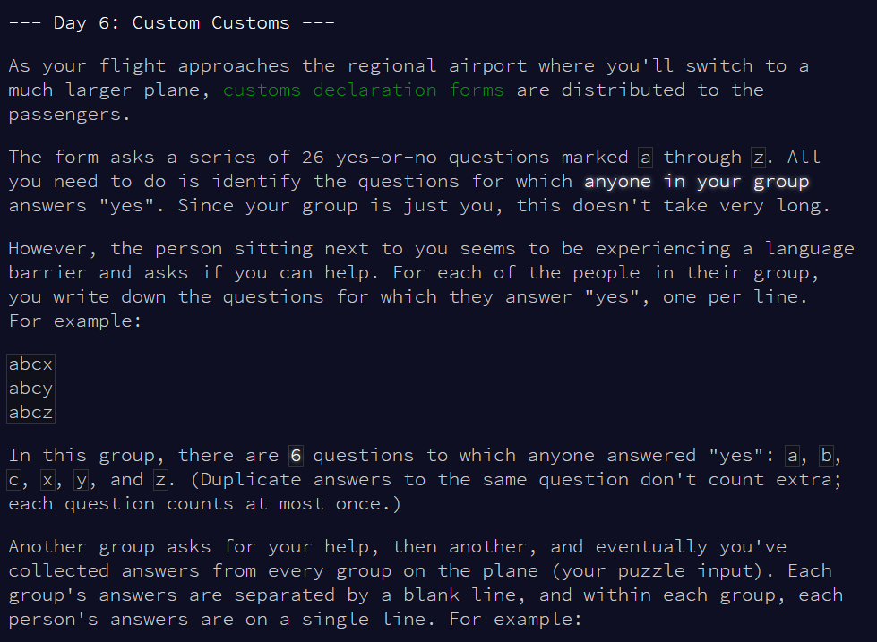
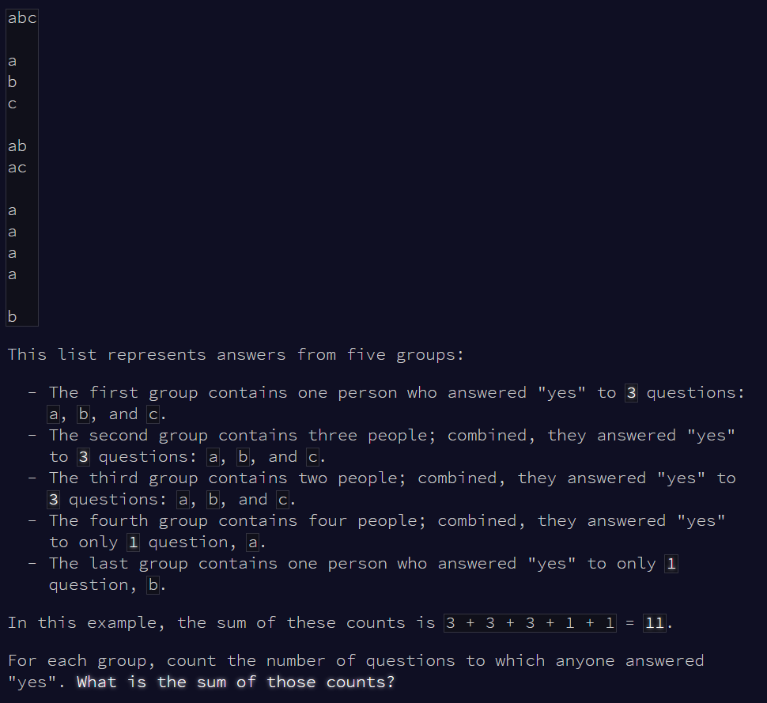
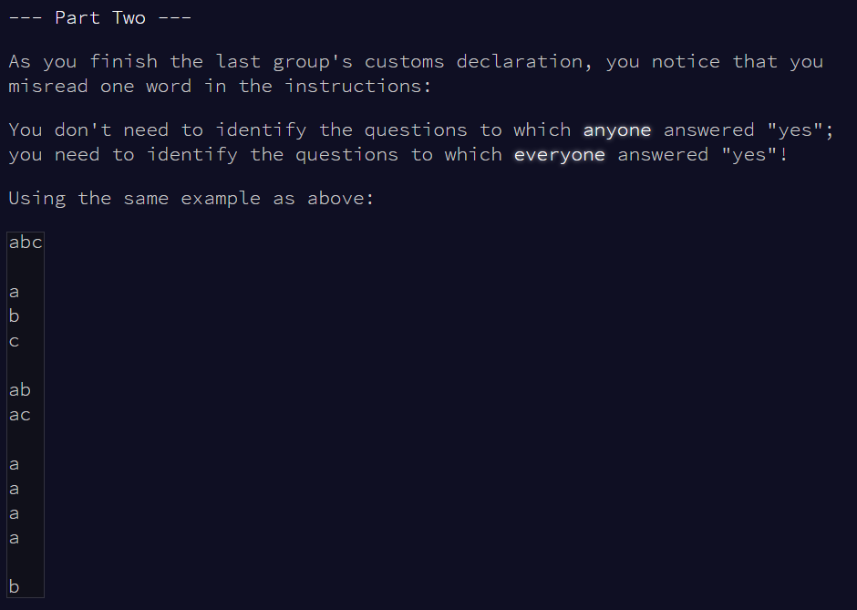
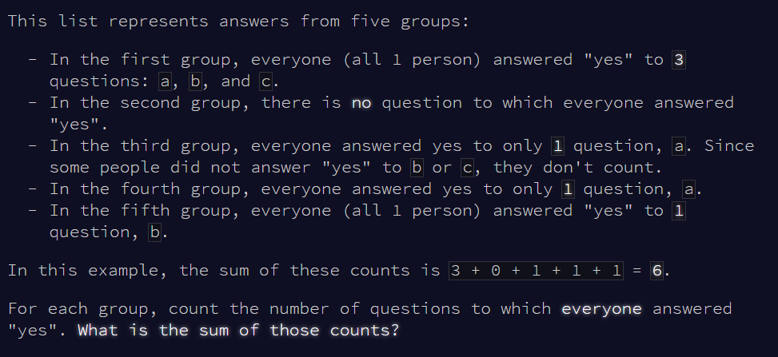

Advent of Code Day 06
================
Lizzie Pearmain
06 December, 2020

-   [Part 1](#part-1)
-   [Part 2](#part-2)





# Part 1

Read input.

``` r
# mini test set
test.v <- readLines("input_test.txt")

# full set
full.v <- readLines("input.txt")
```

Split on empty rows so you get one string per group of answers.

``` r
# v <- test.v  # for testing only
v <- full.v  # for realz

# find empty lines, and add a dummy for the end
ind.empty <- c(1, which(v == ""), (length(v)+1))

v.new <- c()

# loop to split
for (i in 1:(length(ind.empty)-1)) {
  
  # get data for this group
  tmp <- v[ind.empty[i]:(ind.empty[i+1]-1)]
  tmp <- tmp[tmp != ""]  # remove empty strings
  tmp <- paste(tmp, collapse = "")  # without spaces
  
  # add to results
  v.new <- c(v.new, tmp)
}

head(v.new)
```

    ## [1] "xtpmjeuayzkflcdozdaeyxlpftkmojc"                                       
    ## [2] "ifnkhzalvprjtyuslmihuzrytjnsuilmsotygbnhrzjuwslqctjnirzxhy"            
    ## [3] "lhuydwqxaempbisrnfcjtvzrvtcegbhljadfpxzsiuyqwnmrzyvtefjdsplucmqbinahxw"
    ## [4] "whlxgytuoaidpfrsbvmkjqeziwfghlytovbpdemzanjqmpejclwhqziatybogvdf"      
    ## [5] "qsmuehbvfiwlkxgtmdsbrqfwhk"                                            
    ## [6] "lagwjpddpglwjaqgdawplj"

Find number of unique letters in each string (group). The answer is the sum over each group of the number of unique letters.

``` r
num_uniq_ltrs <- function(string) {
  output <- length(unique(as.character(unlist(strsplit(string, "")))))
  return(output)
}
num_uniq_ltrs_v <- Vectorize(num_uniq_ltrs, vectorize.args = "string")

# apply to v.new
v.ans <- num_uniq_ltrs_v(v.new)

# get sum
sum(v.ans)
```

    ## [1] 6878

Answer: sum is 6878.

------------------------------------------------------------------------

# Part 2





Split on empty rows so you get one string per group of answers. BUT this time, concatenate using `;` so that I can split them out again later and get the answers *by each person* in each group rather than just the answers for each group.

``` r
concat_groups <- function(v) {
  
  # find empty lines, and add a dummy for the end
  ind.empty <- c(1, which(v == ""), (length(v)+1))
  
  v.new <- c()
  
  # loop to split
  for (i in 1:(length(ind.empty)-1)) {
    
    # get data for this group
    tmp <- v[ind.empty[i]:(ind.empty[i+1]-1)]
    tmp <- tmp[tmp != ""]  # remove empty strings
    tmp <- paste(tmp, collapse = ";")  # without spaces
    
    # add to results
    v.new <- c(v.new, tmp)
  }
  return(v.new)
}

test.v.new <- concat_groups(test.v)  # for testing only
v.new <- concat_groups(full.v)  # for realz

test.v.new
```

    ## [1] "abc"     "a;b;c"   "ab;ac"   "a;a;a;a" "b"

``` r
head(v.new)
```

    ## [1] "xtpmjeuayzkflcdo;zdaeyxlpftkmojc"                                        
    ## [2] "ifnkhzalvprjtyus;lmihuzrytjns;uilmsotygbnhrzj;uwslqctjnirzxhy"           
    ## [3] "lhuydwqxaempbisrnfcjtvz;rvtcegbhljadfpxzsiuyqwnm;rzyvtefjdsplucmqbinahxw"
    ## [4] "whlxgytuoaidpfrsbvmkjqez;iwfghlytovbpdemzanjq;mpejclwhqziatybogvdf"      
    ## [5] "qsmuehbvfiwlkx;gtmdsbrqfwhk"                                             
    ## [6] "lagwjpd;dpglwja;qgdawplj"

Write a function to:

-   Split by person (on `;`)
-   Get each person's letters
-   Find how many letters are shared between *all* the people in the group (by intersecting 1 with 2, intersecting that result with 3, etc.)

Useful function: `intersect(x, y)`

``` r
intersect(c("a", "b", "c"), c("b", "c", "d"))
```

    ## [1] "b" "c"

``` r
# FUNCTION
num_intersect_ltrs <- function(string) {
  
  # split into people
  people <- as.character(unlist(strsplit(string, ";")))
  
  if (length(people) == 1) {  # IF ONLY ONE PERSON
    
    result <- length(as.character(unlist(strsplit(people, ""))))
    
  } else {  # IF MULTIPLE PEOPLE
    
    # split people into characters
    ppl.list <- strsplit(people, "")
    
    length(people)
    
    # set first element
    set.base <- ppl.list[[1]]
    
    for (i in 2:length(people)) {
      
      # i <- 2  # testing
      
      # get intersection between base and i, feed into next iteration
      set.base <- intersect(set.base, ppl.list[[i]])
      
    }
    
    # get number of uniqe characters in the resulting intersection
    result <- length(unique(set.base))
    
  }
  
  return(result)
  
}
num_intersect_ltrs_v <- Vectorize(num_intersect_ltrs, vectorize.args = "string")

# test function on test set
num_intersect_ltrs_v(test.v.new)
```

    ##     abc   a;b;c   ab;ac a;a;a;a       b 
    ##       3       0       1       1       1

``` r
# apply to ful set (v.new)
v.ans <- num_intersect_ltrs_v(v.new)

# get sum
sum(v.ans)
```

    ## [1] 3464

Answer: sum is 3464.

Day 6 done!
