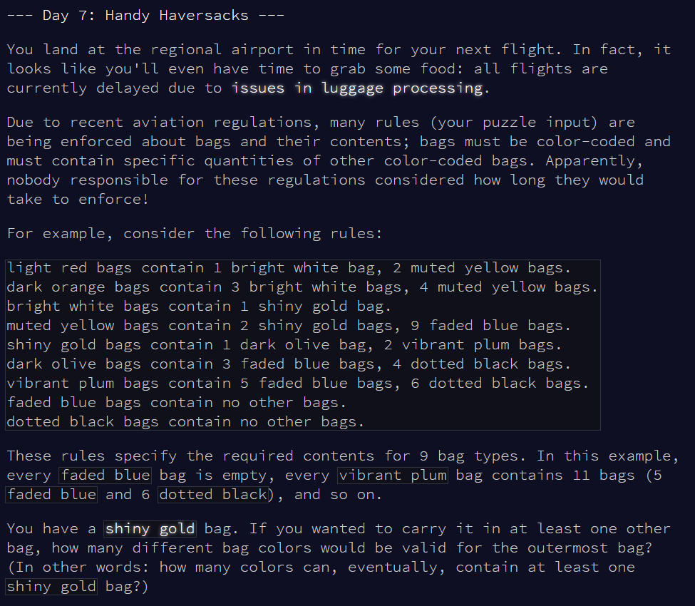
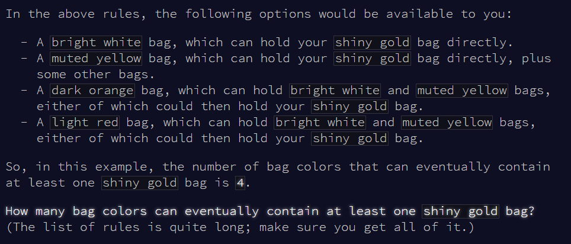

```{r setup, include = F}
library(dplyr)
library(stringr)
library(knitr)
library(kableExtra)
```







# Part 1


Read input.

```{r read-input}

# mini test set
test.v <- readLines("input_test.txt")

# full set
full.v <- readLines("input.txt")

```


Extract rules

```{r extract-rules}

v <- test.v  # testing

head(v)

string <- "mirrored yellow bags contain 1 wavy purple bag, 5 shiny teal bags, 5 shiny cyan bags, 1 shiny crimson bag."

# function
split_rules <- function(string) {
  
  pat.split <- "bag(s)? contain|bag(s)?(\\.)?(,)?"
  output <- stringr::str_squish(as.character(unlist(strsplit(string, pat.split))))
  output <- output[! output == ""]
  
  # return(stringr::str_squish(output))
  n.contains <- length(output)
  
  # make a LIST as output
  # TODO (Lizzie) - continue from here
  res.df <- matrix(nrow=1, ncol=n.contains)
  res.df[1,1] <- output[1]
  
  for (i in 2:n.contains) {
    # i <- 2
    res.df[1,i] <- output[i]
  }
  res.df
}
split_rules_v <- Vectorize(split_rules, vectorize.args = "string")


t <- v[1]
split_rules(t)

split_rules("mirrored yellow bags contain 1 wavy purple bag, 5 shiny teal bags, 5 shiny cyan bags, 1 shiny crimson bag.")

```


Answer: sum is `r sum(v.ans)`.


Day 7 done!


