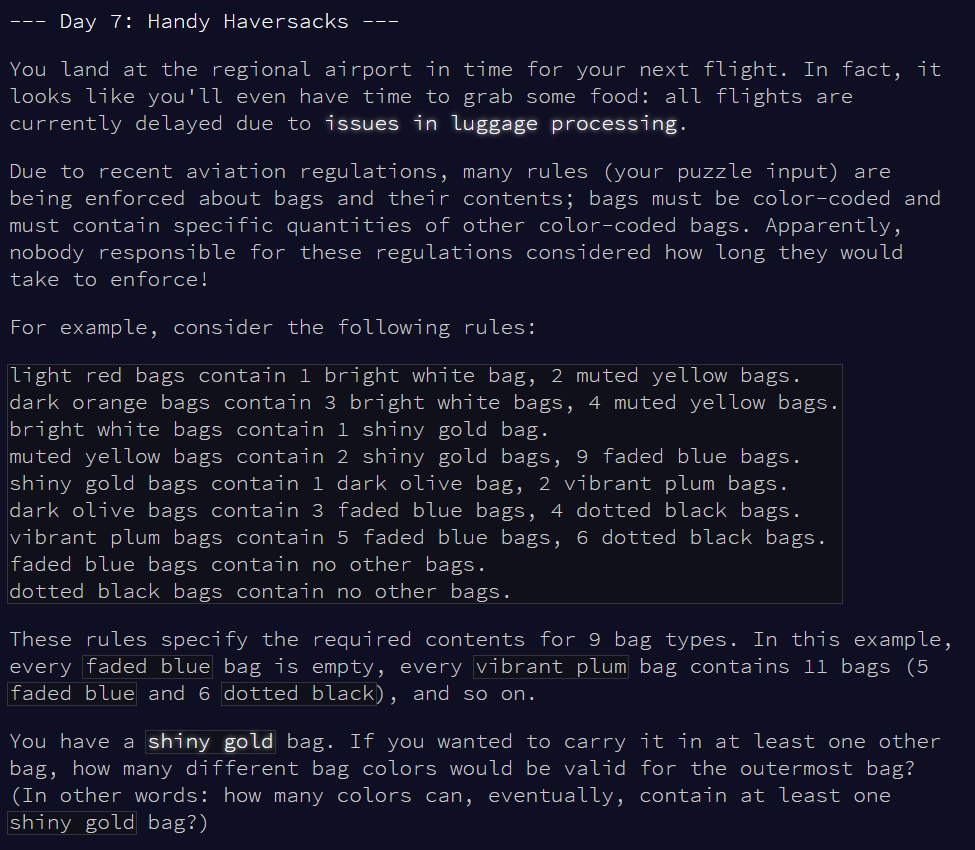
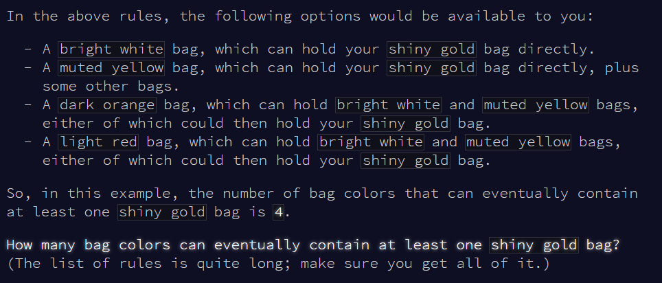
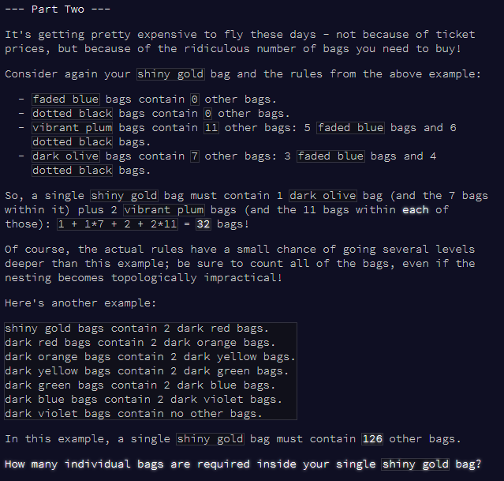

Advent of Code Day 07
================
Lizzie Pearmain
07 December, 2020

-   [Part 1](#part-1)
    -   [list of rules](#list-of-rules)
    -   [write function](#write-function)
    -   [apply function](#apply-function)
-   [Part 2](#part-2)





# Part 1

Read input.

``` r
# mini test set
test.v <- readLines("input_test.txt")

# full set
full.v <- readLines("input.txt")
```

## list of rules

Extract rules as a nested list.

``` r
v <- test.v  # testing

# write function
split_rules <- function(string) {
  # split into colour and their numbers
  pat.split <- "bag(s)? contain|bag(s)?(\\.)?(,)?"
  output <- stringr::str_squish(as.character(unlist(strsplit(string, pat.split))))
  output <- output[! output == ""]  # remove empty strings
  output <- output[! output == "no other"]  # remove 'no other'
  
  # return(stringr::str_squish(output))
  n.contains <- length(output)
  
  # make a LIST as output
  a <- c("NAME")
  b <- c(output[1])
  
  # loop IF n.contains is bigger than 1
  if (n.contains > 1) {
    for (i in 2:n.contains) {
      # i <- 2
      # output[i]
      i.colour <- str_extract(output[i], "[:lower:]+\\s[:lower:]+")  # get colour
      i.number <- str_extract(output[i], "\\d+")  # get number
      a <- c(a, i.colour)  # add to a and b
      b <- c(b, i.number)
    }
  }
  # make a list
  res.list <- structure(as.list(b), names=a)
  return(res.list)
}

# test function on one string
string <- "mirrored yellow bags contain 1 wavy purple bag, 5 shiny teal bags, 5 shiny cyan bags, 1 shiny crimson bag."
split_rules(string)
```

    ## $NAME
    ## [1] "mirrored yellow"
    ## 
    ## $`wavy purple`
    ## [1] "1"
    ## 
    ## $`shiny teal`
    ## [1] "5"
    ## 
    ## $`shiny cyan`
    ## [1] "5"
    ## 
    ## $`shiny crimson`
    ## [1] "1"

``` r
# apply to multiple strings, bind into a list
list(split_rules(v[1]), split_rules(v[2]))  # test with 2 of them
```

    ## [[1]]
    ## [[1]]$NAME
    ## [1] "light red"
    ## 
    ## [[1]]$`bright white`
    ## [1] "1"
    ## 
    ## [[1]]$`muted yellow`
    ## [1] "2"
    ## 
    ## 
    ## [[2]]
    ## [[2]]$NAME
    ## [1] "dark orange"
    ## 
    ## [[2]]$`bright white`
    ## [1] "3"
    ## 
    ## [[2]]$`muted yellow`
    ## [1] "4"

``` r
lapply(v[c(1,2)], split_rules)  # test lapply - it works!
```

    ## [[1]]
    ## [[1]]$NAME
    ## [1] "light red"
    ## 
    ## [[1]]$`bright white`
    ## [1] "1"
    ## 
    ## [[1]]$`muted yellow`
    ## [1] "2"
    ## 
    ## 
    ## [[2]]
    ## [[2]]$NAME
    ## [1] "dark orange"
    ## 
    ## [[2]]$`bright white`
    ## [1] "3"
    ## 
    ## [[2]]$`muted yellow`
    ## [1] "4"

``` r
# EXTRACT TEST SET AND FULL SET ----

# apply to the whole set with lapply()
v.test.list <- lapply(test.v, split_rules)
v.full.list <- lapply(full.v, split_rules)

# clean up
rm(v, string)
```

## write function

Write function to take a particular colour, find all the colours that can contain that colour, and find all the colours that can contain *those* colours, ... etc.

``` r
find_containing_colours <- function(colour, my.list) {
  # find where this colour appears in the list
  inds <- grep(colour, my.list)
  cols.list <- my.list[inds]
  
  # get the colours under which it appears
  cols.containing <- c()
  for (i in 1:length(cols.list)) {
    cols.containing <- c(cols.containing, my.list[inds][[i]]$NAME)
  }
  return(cols.containing)
}

find_all_cols_eventually_containing <- function(colour, my.list) {
  
  # rename variables
  ori.col <- colour
  
  # list of checked colours
  cols.checked <- c(ori.col)
  
  # find cols containing this col
  cols.containing <- find_containing_colours(ori.col, my.list)
  
  # which of these are not already in cols.checked?
  cols.unchecked <- cols.containing[! cols.containing %in% cols.checked]
  
  # WHILE LOOP - while cols.unchecked is still > 0
  while (length(cols.unchecked) > 0) {
    
    # for each of these unchecked cols, add to checked, and check it!
    for (i in 1:length(cols.unchecked)) {
      
      tmp.col <- cols.unchecked[i]
      
      # add it to cols.checked
      cols.checked <- c(cols.checked, tmp.col)
      
      # get cols containing it
      tmp.cols.containing <- find_containing_colours(tmp.col, my.list)
      
      # add to cols containing
      cols.containing <- unique(c(cols.containing, tmp.cols.containing))
      
    }
    
    # update unchecked list - if there is still stuff here, we're not done.
    cols.unchecked <- cols.containing[! cols.containing %in% cols.checked]
    
  }
  
  return(cols.containing)
}
```

## apply function

Test function with the test set

``` r
# test with shiny gold on the test set
cols.containing <- find_all_cols_eventually_containing("shiny gold", v.test.list)
# how many bag colours?
length(cols.containing) - 1  # -1 because shiny gold is still in there
```

    ## [1] 4

Now for the real set

``` r
# test with shiny gold on the test set
cols.containing <- find_all_cols_eventually_containing("shiny gold", v.full.list)
# how many bag colours?
length(cols.containing) - 1  # -1 because shiny gold is still in there
```

    ## [1] 121

Answer: sum is 121.

------------------------------------------------------------------------

# Part 2



Read in the new test list and create the list of rules.

``` r
# read new test set
test2.v <- readLines("input_test_part2.txt")

# make list of rules
v.test2.list <- lapply(test2.v, split_rules)
```

New function needs to:

-   Find the element in the list that has NAME 'shiny gold'
-   Find the colours contained, and the number of those colours
-   Iterate over the levels, keeping a counter of the number of bags counted.
