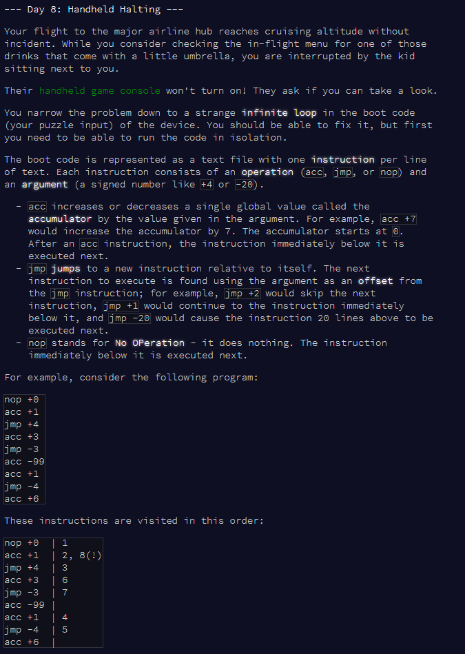

```{r setup, include = F}
library(dplyr)
library(stringr)
library(knitr)
library(kableExtra)
```





# Part 1


```{r read-input}

# function to read input as data frame
read_as_df <- function(file) {
  df <- as.data.frame(matrix(unlist(strsplit(readLines(file), " ")), ncol = 2, byrow = TRUE))
  # colnames
  colnames(df) <- c("op", "arg")
  # add a col for flagging if it's already been run
  df$dup <- F
  return(df)
}

# read test input
df.test <- read_as_df("input_test.txt")
df.test

# read full input
df.full <- read_as_df("input.txt")
head(df.full)

```

Define function for running each step.

```{r step-function}
# function to run each step and output new index and accumulator
run_step <- function(index, accum, op, arg) {
  if (op == "nop") {
    new.index <- index + 1
    new.accum <- accum
  } else if (op == "acc") {
    new.index <- index + 1
    new.accum <- accum + arg
  } else if (op == "jmp") {
    new.index <- index + arg
    new.accum <- accum
  }
  return(c(new.index, new.accum))
}
```


To run the algorithm, we'll need a `while()` loop with a flag for whether we're about to run a line we've already run.


```{r while-loop}

run_until_dup <- function(df) {
  
  # set flag to false
  flag.dup <- F
  
  # first instruction
  i <- 1
  
  # start accumulator
  accumulator <- 0
  
  # while loop
  while (flag.dup == F) {
    
    # get current row
    df[i, ]
    tmp.op <- as.character(df[i,1])
    tmp.arg <- as.numeric(df[i,2])
    
    # mark it as done
    df[i,3] <- T
    
    # run the row and get the index of the next row, and the new accumulator value
    run.output <- run_step(i, accumulator, tmp.op, tmp.arg)
    new.i <- run.output[1]
    new.accum <- run.output[2]
    
    # check if the next row has already been done
    if (df[new.i,3] == T) {
      flag.dup <- T
    }
    
    # replace index and accumulator with the new ones
    i <- new.i
    accumulator <- new.accum
    
  }
  
  # output the accumulator
  return(accumulator)
}

# try on test input
run_until_dup(df.test)

# try on real input
ans.real <- run_until_dup(df.full)
ans.real

```


At the end of the loop, the accumulator is `r ans.real`.


*** 

# Part 2


