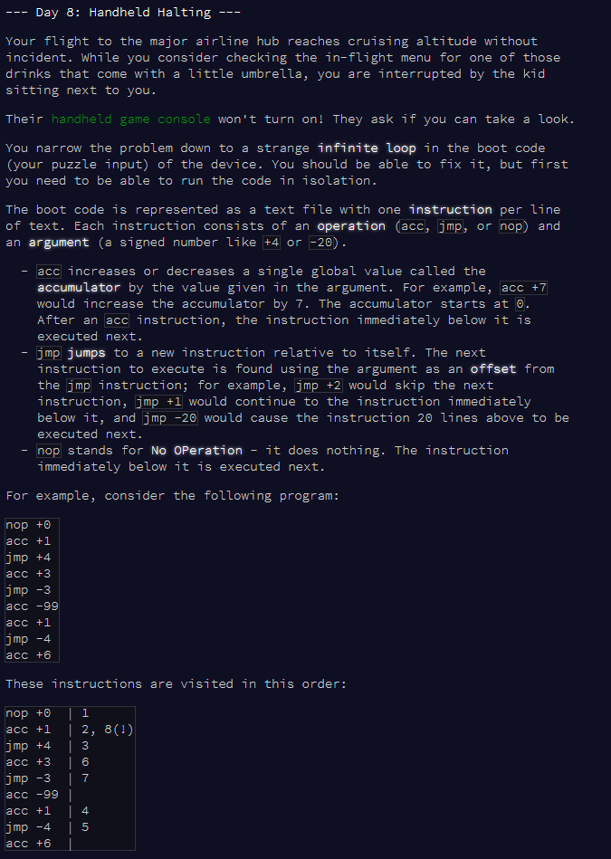
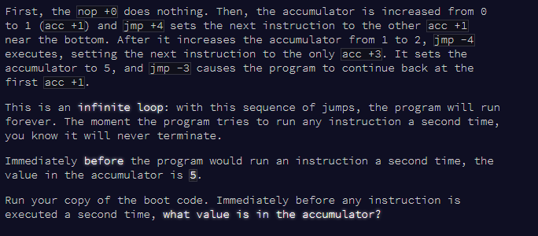
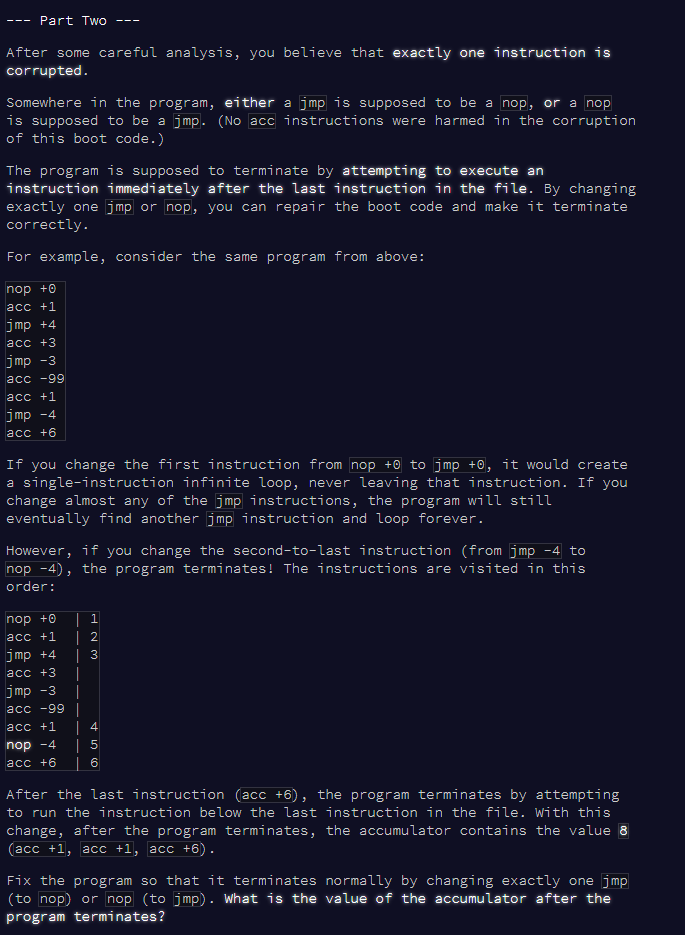

Advent of Code Day 08
================
Lizzie Pearmain
09 December, 2020

-   [Part 1](#part-1)
-   [Part 2](#part-2)





# Part 1

``` r
# function to read input as data frame
read_as_df <- function(file) {
  df <- as.data.frame(matrix(unlist(strsplit(readLines(file), " ")), ncol = 2, byrow = TRUE))
  # colnames
  colnames(df) <- c("op", "arg")
  # add a col for flagging if it's already been run
  df$dup <- F
  return(df)
}

# read test input
df.test <- read_as_df("input_test.txt")
df.test
```

    ##    op arg   dup
    ## 1 nop  +0 FALSE
    ## 2 acc  +1 FALSE
    ## 3 jmp  +4 FALSE
    ## 4 acc  +3 FALSE
    ## 5 jmp  -3 FALSE
    ## 6 acc -99 FALSE
    ## 7 acc  +1 FALSE
    ## 8 jmp  -4 FALSE
    ## 9 acc  +6 FALSE

``` r
# read full input
df.full <- read_as_df("input.txt")
head(df.full)
```

    ##    op  arg   dup
    ## 1 acc  +22 FALSE
    ## 2 acc   +0 FALSE
    ## 3 jmp   +1 FALSE
    ## 4 acc  +49 FALSE
    ## 5 jmp +203 FALSE
    ## 6 jmp +545 FALSE

Define function for running each step.

``` r
# function to run each step and output new index and accumulator
run_step <- function(index, accum, op, arg) {
  if (op == "nop") {
    new.index <- index + 1
    new.accum <- accum
  } else if (op == "acc") {
    new.index <- index + 1
    new.accum <- accum + arg
  } else if (op == "jmp") {
    new.index <- index + arg
    new.accum <- accum
  }
  return(c(new.index, new.accum))
}
```

To run the algorithm, we'll need a `while()` loop with a flag for whether we're about to run a line we've already run.

``` r
run_until_dup <- function(df) {
  
  # set flag to false
  flag.dup <- F
  
  # first instruction
  i <- 1
  
  # start accumulator
  accumulator <- 0
  
  # while loop
  while (flag.dup == F) {
    
    # get current row
    df[i, ]
    tmp.op <- as.character(df[i,1])
    tmp.arg <- as.numeric(df[i,2])
    
    # mark it as done
    df[i,3] <- T
    
    # run the row and get the index of the next row, and the new accumulator value
    run.output <- run_step(i, accumulator, tmp.op, tmp.arg)
    new.i <- run.output[1]
    new.accum <- run.output[2]
    
    # check if the next row has already been done
    if (df[new.i,3] == T) {
      flag.dup <- T
    }
    
    # replace index and accumulator with the new ones
    i <- new.i
    accumulator <- new.accum
    
  }
  
  # output the accumulator
  return(accumulator)
}

# try on test input
run_until_dup(df.test)
```

    ## [1] 5

``` r
# try on real input
ans.real <- run_until_dup(df.full)
ans.real
```

    ## [1] 1930

At the end of the loop, the accumulator is 1930.

------------------------------------------------------------------------

# Part 2



Change exactly one instruction, and see if the final index is length(input) + 1.

Add this 'end' as a stop to the while loop.

``` r
run_until_dup_or_end <- function(df) {
  
  # set flag to false
  flag.dup.or.end <- F
  
  # first instruction
  i <- 1
  
  # start accumulator
  accumulator <- 0
  
  # while loop
  while (flag.dup.or.end == F) {
    
    # get current row
    df[i, ]
    tmp.op <- as.character(df[i,1])
    tmp.arg <- as.numeric(df[i,2])
    
    # mark it as done
    df[i,3] <- T
    
    # run the row and get the index of the next row, and the new accumulator value
    run.output <- run_step(i, accumulator, tmp.op, tmp.arg)
    new.i <- run.output[1]
    new.accum <- run.output[2]
    
    # flag if the next row has already been done
    # OR if the next row is the last row + 1
    if (df[new.i,3] == T | new.i == (nrow(df)+1)) {
      flag.dup.or.end <- T
    }
    
    # replace index and accumulator with the new ones
    i <- new.i
    accumulator <- new.accum
    
  }
  
  # output the accumulator AND the final index
  return(c(accumulator, new.i))
}
```

Run this new function on the original and fixed versions of the test input.

``` r
df.test.fixed <- read_as_df("input_test_fixed.txt")
df.test.fixed
```

    ##    op arg   dup
    ## 1 nop  +0 FALSE
    ## 2 acc  +1 FALSE
    ## 3 jmp  +4 FALSE
    ## 4 acc  +3 FALSE
    ## 5 jmp  -3 FALSE
    ## 6 acc -99 FALSE
    ## 7 acc  +1 FALSE
    ## 8 nop  -4 FALSE
    ## 9 acc  +6 FALSE

``` r
run_until_dup_or_end(df.test)  # original version
```

    ## [1] 5 2

``` r
run_until_dup_or_end(df.test.fixed)  # fixed version
```

    ## [1]  8 10

On the fixed version, the final index (second part of the output) is nrow(df) + 1. Which is exactly what we want for the *fixed* version.

Now, loop through each row, if it's fix-able then change it, run the function, check if the final index is nrow(df)+1. If it is, then that fix was the fix we're looking for!

``` r
df <- df.full

for (r in 1:nrow(df)) {
  
  # r <- 1  # test
  
  # if it's fix-able, fix it and run function on the new version
  if (df$op[r] %in% c("nop", "jmp")) {
    
    # create copy of the df
    df.fix <- df
    
    # fix this operation
    if (df$op[r] == "nop") {
      df.fix$op[r] <- "jmp"
    } else if (df$op[r] == "jmp") {
      df.fix$op[r] <- "nop"
    }
    
    # run the function
    output <- run_until_dup_or_end(df.fix)
    
    # if output[2] is nrow(df)+1, we're done.
    if (output[2] == (nrow(df)+1)) {
      cat("Loop finished, answer found!\n")
      break()
    }
  }
}
```

    ## Loop finished, answer found!

``` r
# get final value of accumulator
output[1]
```

    ## [1] 1688

Answer is 1688.

Day 8 done! Hooray!
