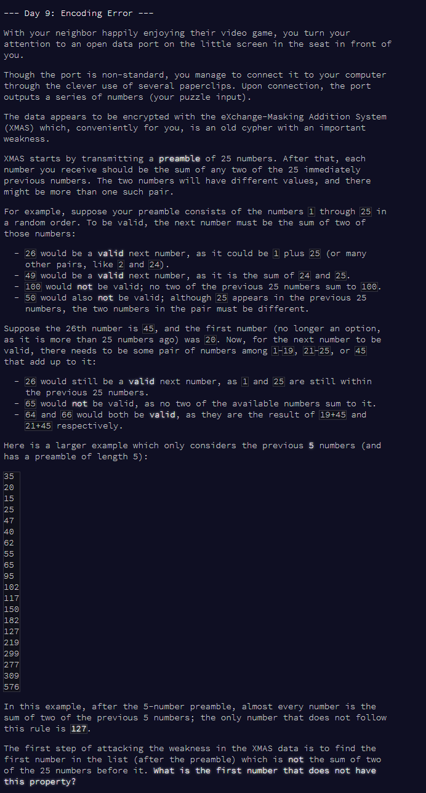
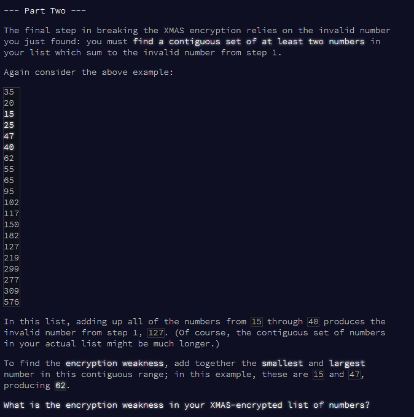

```{r setup, include = F}
library(dplyr)
library(stringr)
library(knitr)
library(kableExtra)
```





# Part 1

Read test and real input.

```{r read-input}

# read test input
v.test <- readLines("input_test.txt") %>%
  as.numeric()
v.test

# read full input
v.full <- readLines("input.txt") %>%
  as.numeric()

```

Define function for running the algorithm:

* Skip first N numbers, start at number N+1, loop over all the numbers (as i)
* Get previous N numbers
* Find all possible values of [sum of any of the previous N numbers]
* Check if number i is one of those possible values.


First, a function to find pairwise sums

```{r function-1}

# function to get vector of pairwise sums of a vector with itself
# NB. sums of *different* numbers only
get_pairwise_sums <- function(vec) {
  m <- outer(vec, vec, FUN = "+")
  diag(m) <- NA  # remove diagonals
  sums <- unique(as.numeric(m))
  sums <- sums[! is.na(sums)]
  return(sums)
}
```

Next, a while loop to loop through the numbers in the vector and find the first one which does not satisfy the requirement.

I will test on the test set (`v.test`) first of all, then functionise what I have done.

```{r function-2}

v <- v.test  # for testing

flag <- TRUE  # start flag at T

# for test version, N = 5
N <- 5

# start at 1, skip first N numbers
i <- 1 + N

# WHILE LOOP 

while(flag == T) {
  
  # get current number
  tmp.val <- v[i]
  
  # get previous N numbers
  tmp.prevs <- v[(i-N):(i-1)]
  
  # get pairwise sums of these previous N numbers
  tmp.sums <- get_pairwise_sums(tmp.prevs)
  
  # is this number the sum of two of the previous N numbers?
  flag <- tmp.val %in% tmp.sums
  
  # move on to next i
  i <- i + 1
  
}

i-1  # where did we stop?
v[i-1]  # number at which we stopped


# FUNCTION for v = vector of numbers, N = preamble length
find_first_wrong_number <- function(v, N) {
  flag <- TRUE
  i <- 1 + N
  # WHILE LOOP 
  while(flag == T) {
    tmp.val <- v[i]
    tmp.prevs <- v[(i-N):(i-1)]
    tmp.sums <- get_pairwise_sums(tmp.prevs)
    flag <- tmp.val %in% tmp.sums
    i <- i + 1
  }
  return(v[i-1])  # number at which we stopped
}

```

Now, I will test the function again on the test set and apply to the full set.

```{r apply-function}

find_first_wrong_number(v.test, 5)
find_first_wrong_number(v.full, 25)

```

The answer is: `r find_first_wrong_number(v.full, 25)`

```{r cleanup, include = F}
rm(flag, i, N, tmp.prevs, tmp.sums, tmp.val, v)
```


***

# Part 2




Options:

* Loop through the possible _lengths_ of the contiguous block: try each number on its own, then each pair, etc.
* Loop through possible _lengths_ of the contiguous block: e.g. if len = 2, add the vector to [itself offset by 1] to get the sums, check if the aim number is among them. If len = 3, offset by 1 again, add, and check if aim number is among them. etc. _NB: don't do len = 1 as then I will just find the number itself in the list!_
* Chosen option: find cumulative sum at each point in the vector. Find difference between _each pair_ of those cumsum values (as a 2-D matrix). This gives you all possible sums of all possible blocks of all possible lengths. Find the aim number - the indices of it in the matrix give you the indices of the start and end (ish) of the correct block.

I'll go for the 3rd option. 

_NOTE:_ I will remove the aim number itself from the list (so that I don't just find _it_ as a 'block of length 1 that sums to the aim number'). This creates a _small_ possibility that removing that number will have created another block that meets the conditions. If that has happened, I'll find _two_ sets of indices in the matrix, and will deal with that if I come to it.

First, test with the test set, outputting the results at each point:

```{r part-2-test}

v <- v.test  # using test set
N <- 5  # with 5 preamble


aim <- find_first_wrong_number(v, N)
aim

# remove that number from v
v <- v[which(! v == aim)]

# get cumsum at each point of v
v1 <- cumsum(v)
v1

# make matrix of differences between each element in v1
# transposed to make the indices go from smaller to larger, which is neater for the next step
m <- t(outer(v1, v1, "-"))
m

# find indices in m of the aim number
inds <- which(m == aim, arr.ind = T)
inds

# these are (almost) the indices in v of the start and end of the block
i.sta <- inds[1] + 1
i.end <- inds[2]

block <- v[i.sta:i.end]
block

# answer: sum of the smallest and largest numbers in the block
ans <- sum(min(block), max(block))
ans

```

Now run through with the test set, _not_ printing the results of each row.

```{r part-2-full}

v <- v.full  # using full set as v
N <- 25  # with 25 preamble

aim <- find_first_wrong_number(v, N)
aim

# remove that number from v
v <- v[which(! v == aim)]

# get cumsum at each point of v
v1 <- cumsum(v)

# make matrix of differences between each element in v1
# transposed to make the indices go from smaller to larger, which is neater for the next step
m <- t(outer(v1, v1, "-"))

# find indices in m of the aim number
inds <- which(m == aim, arr.ind = T)
inds

# these are (almost) the indices in v of the start and end of the block
i.sta <- inds[1] + 1
i.end <- inds[2]

block <- v[i.sta:i.end]
block

# answer: sum of the smallest and largest numbers in the block
ans <- sum(min(block), max(block))
ans

```


Day 9 done!


