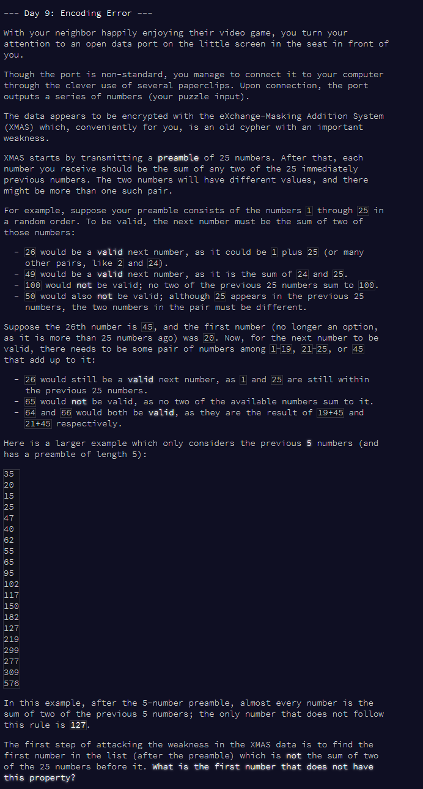
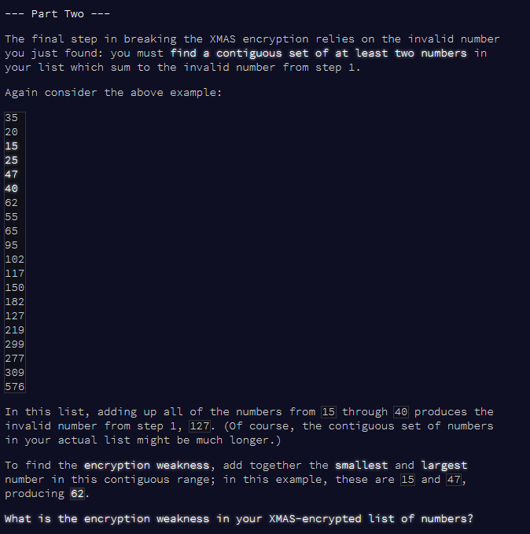

Advent of Code Day 09
================
Lizzie Pearmain
09 December, 2020

-   [Part 1](#part-1)
-   [Part 2](#part-2)



# Part 1

Read test and real input.

``` r
# read test input
v.test <- readLines("input_test.txt") %>%
  as.numeric()
v.test
```

    ##  [1]  35  20  15  25  47  40  62  55  65  95 102 117 150 182 127 219 299 277 309
    ## [20] 576

``` r
# read full input
v.full <- readLines("input.txt") %>%
  as.numeric()
```

Define function for running the algorithm:

-   Skip first N numbers, start at number N+1, loop over all the numbers (as i)
-   Get previous N numbers
-   Find all possible values of \[sum of any of the previous N numbers\]
-   Check if number i is one of those possible values.

First, a function to find pairwise sums

``` r
# function to get vector of pairwise sums of a vector with itself
# NB. sums of *different* numbers only
get_pairwise_sums <- function(vec) {
  m <- outer(vec, vec, FUN = "+")
  diag(m) <- NA  # remove diagonals
  sums <- unique(as.numeric(m))
  sums <- sums[! is.na(sums)]
  return(sums)
}
```

Next, a while loop to loop through the numbers in the vector and find the first one which does not satisfy the requirement.

I will test on the test set (`v.test`) first of all, then functionise what I have done.

``` r
v <- v.test  # for testing

flag <- TRUE  # start flag at T

# for test version, N = 5
N <- 5

# start at 1, skip first N numbers
i <- 1 + N

# WHILE LOOP 

while(flag == T) {
  
  # get current number
  tmp.val <- v[i]
  
  # get previous N numbers
  tmp.prevs <- v[(i-N):(i-1)]
  
  # get pairwise sums of these previous N numbers
  tmp.sums <- get_pairwise_sums(tmp.prevs)
  
  # is this number the sum of two of the previous N numbers?
  flag <- tmp.val %in% tmp.sums
  
  # move on to next i
  i <- i + 1
  
}

i-1  # where did we stop?
```

    ## [1] 15

``` r
v[i-1]  # number at which we stopped
```

    ## [1] 127

``` r
# FUNCTION for v = vector of numbers, N = preamble length
find_first_wrong_number <- function(v, N) {
  flag <- TRUE
  i <- 1 + N
  # WHILE LOOP 
  while(flag == T) {
    tmp.val <- v[i]
    tmp.prevs <- v[(i-N):(i-1)]
    tmp.sums <- get_pairwise_sums(tmp.prevs)
    flag <- tmp.val %in% tmp.sums
    i <- i + 1
  }
  return(v[i-1])  # number at which we stopped
}
```

Now, I will test the function again on the test set and apply to the full set.

``` r
find_first_wrong_number(v.test, 5)
```

    ## [1] 127

``` r
find_first_wrong_number(v.full, 25)
```

    ## [1] 1038347917

The answer is: 1.038347910^{9}

------------------------------------------------------------------------

# Part 2



Options:

-   Loop through the possible *lengths* of the contiguous block: try each number on its own, then each pair, etc.
-   Loop through possible *lengths* of the contiguous block: e.g. if len = 2, add the vector to \[itself offset by 1\] to get the sums, check if the aim number is among them. If len = 3, offset by 1 again, add, and check if aim number is among them. etc. *NB: don't do len = 1 as then I will just find the number itself in the list!*
-   Chosen option: find cumulative sum at each point in the vector. Find difference between *each pair* of those cumsum values (as a 2-D matrix). This gives you all possible sums of all possible blocks of all possible lengths. Find the aim number - the indices of it in the matrix give you the indices of the start and end (ish) of the correct block.

I'll go for the 3rd option.

*NOTE:* I will remove the aim number itself from the list (so that I don't just find *it* as a 'block of length 1 that sums to the aim number'). This creates a *small* possibility that removing that number will have created another block that meets the conditions. If that has happened, I'll find *two* sets of indices in the matrix, and will deal with that if I come to it.

First, test with the test set, outputting the results at each point:

``` r
v <- v.test  # using test set
N <- 5  # with 5 preamble


aim <- find_first_wrong_number(v, N)
aim
```

    ## [1] 127

``` r
# remove that number from v
v <- v[which(! v == aim)]

# get cumsum at each point of v
v1 <- cumsum(v)
v1
```

    ##  [1]   35   55   70   95  142  182  244  299  364  459  561  678  828 1010 1229
    ## [16] 1528 1805 2114 2690

``` r
# make matrix of differences between each element in v1
# transposed to make the indices go from smaller to larger, which is neater for the next step
m <- t(outer(v1, v1, "-"))
m
```

    ##        [,1]  [,2]  [,3]  [,4]  [,5]  [,6]  [,7]  [,8]  [,9] [,10] [,11] [,12]
    ##  [1,]     0    20    35    60   107   147   209   264   329   424   526   643
    ##  [2,]   -20     0    15    40    87   127   189   244   309   404   506   623
    ##  [3,]   -35   -15     0    25    72   112   174   229   294   389   491   608
    ##  [4,]   -60   -40   -25     0    47    87   149   204   269   364   466   583
    ##  [5,]  -107   -87   -72   -47     0    40   102   157   222   317   419   536
    ##  [6,]  -147  -127  -112   -87   -40     0    62   117   182   277   379   496
    ##  [7,]  -209  -189  -174  -149  -102   -62     0    55   120   215   317   434
    ##  [8,]  -264  -244  -229  -204  -157  -117   -55     0    65   160   262   379
    ##  [9,]  -329  -309  -294  -269  -222  -182  -120   -65     0    95   197   314
    ## [10,]  -424  -404  -389  -364  -317  -277  -215  -160   -95     0   102   219
    ## [11,]  -526  -506  -491  -466  -419  -379  -317  -262  -197  -102     0   117
    ## [12,]  -643  -623  -608  -583  -536  -496  -434  -379  -314  -219  -117     0
    ## [13,]  -793  -773  -758  -733  -686  -646  -584  -529  -464  -369  -267  -150
    ## [14,]  -975  -955  -940  -915  -868  -828  -766  -711  -646  -551  -449  -332
    ## [15,] -1194 -1174 -1159 -1134 -1087 -1047  -985  -930  -865  -770  -668  -551
    ## [16,] -1493 -1473 -1458 -1433 -1386 -1346 -1284 -1229 -1164 -1069  -967  -850
    ## [17,] -1770 -1750 -1735 -1710 -1663 -1623 -1561 -1506 -1441 -1346 -1244 -1127
    ## [18,] -2079 -2059 -2044 -2019 -1972 -1932 -1870 -1815 -1750 -1655 -1553 -1436
    ## [19,] -2655 -2635 -2620 -2595 -2548 -2508 -2446 -2391 -2326 -2231 -2129 -2012
    ##       [,13] [,14] [,15] [,16] [,17] [,18] [,19]
    ##  [1,]   793   975  1194  1493  1770  2079  2655
    ##  [2,]   773   955  1174  1473  1750  2059  2635
    ##  [3,]   758   940  1159  1458  1735  2044  2620
    ##  [4,]   733   915  1134  1433  1710  2019  2595
    ##  [5,]   686   868  1087  1386  1663  1972  2548
    ##  [6,]   646   828  1047  1346  1623  1932  2508
    ##  [7,]   584   766   985  1284  1561  1870  2446
    ##  [8,]   529   711   930  1229  1506  1815  2391
    ##  [9,]   464   646   865  1164  1441  1750  2326
    ## [10,]   369   551   770  1069  1346  1655  2231
    ## [11,]   267   449   668   967  1244  1553  2129
    ## [12,]   150   332   551   850  1127  1436  2012
    ## [13,]     0   182   401   700   977  1286  1862
    ## [14,]  -182     0   219   518   795  1104  1680
    ## [15,]  -401  -219     0   299   576   885  1461
    ## [16,]  -700  -518  -299     0   277   586  1162
    ## [17,]  -977  -795  -576  -277     0   309   885
    ## [18,] -1286 -1104  -885  -586  -309     0   576
    ## [19,] -1862 -1680 -1461 -1162  -885  -576     0

``` r
# find indices in m of the aim number
inds <- which(m == aim, arr.ind = T)
inds
```

    ##      row col
    ## [1,]   2   6

``` r
# these are (almost) the indices in v of the start and end of the block
i.sta <- inds[1] + 1
i.end <- inds[2]

block <- v[i.sta:i.end]
block
```

    ## [1] 15 25 47 40

``` r
# answer: sum of the smallest and largest numbers in the block
ans <- sum(min(block), max(block))
ans
```

    ## [1] 62

Now run through with the test set, *not* printing the results of each row.

``` r
v <- v.full  # using full set as v
N <- 25  # with 25 preamble

aim <- find_first_wrong_number(v, N)
aim
```

    ## [1] 1038347917

``` r
# remove that number from v
v <- v[which(! v == aim)]

# get cumsum at each point of v
v1 <- cumsum(v)

# make matrix of differences between each element in v1
# transposed to make the indices go from smaller to larger, which is neater for the next step
m <- t(outer(v1, v1, "-"))

# find indices in m of the aim number
inds <- which(m == aim, arr.ind = T)
inds
```

    ##      row col
    ## [1,] 529 546

``` r
# these are (almost) the indices in v of the start and end of the block
i.sta <- inds[1] + 1
i.end <- inds[2]

block <- v[i.sta:i.end]
block
```

    ##  [1] 44615102 43725476 44648839 45029251 47640942 56365291 79304138 62256657
    ##  [9] 46882839 82571714 49053440 62979028 68834924 57938100 93668542 81648351
    ## [17] 71185283

``` r
# answer: sum of the smallest and largest numbers in the block
ans <- sum(min(block), max(block))
ans
```

    ## [1] 137394018

Day 9 done!
