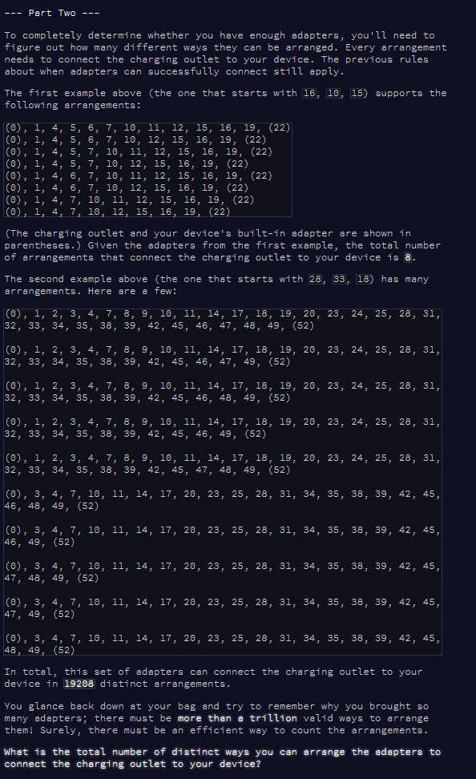

Advent of Code Day 10
================
Lizzie Pearmain
10 December, 2020

-   [Part 1](#part-1)
-   [Part 2](#part-2)


Apparently we're daisy-chaining electrical adapters. On an aeroplane. Which seems ill-advised, but here we go.

# Part 1

Read test and real input.

``` r
# read test inputs
v.test.a <- readLines("input_test_A.txt") %>%
  as.numeric()
v.test.a
```

    ##  [1] 16 10 15  5  1 11  7 19  6 12  4

``` r
v.test.b <- readLines("input_test_B.txt") %>%
  as.numeric()
v.test.b
```

    ##  [1] 28 33 18 42 31 14 46 20 48 47 24 23 49 45 19 38 39 11  1 32 25 35  8 17  7
    ## [26]  9  4  2 34 10  3

``` r
# read full input
v.full <- readLines("input.txt") %>%
  as.numeric()
head(v.full)
```

    ## [1]  67 118  90  41 105  24

Approach to solving the problem:

-   Sort the numbers in ascending order (add a 0 at the start and a +3 at the end)
-   Get vector of differences between consecutive numbers
-   Count the 1s and 3s
-   Multiple number of 1s by number of 3s to get the final answer.

``` r
# define function
diffs_1s_times_3s <- function(v) {
  # sort, add 0 and start and +3 at end
  v <- c(0, sort(v), (max(v)+3))
  
  # get diffs
  diffs <- diff(v, lag = 1)
  
  # check correct number
  stopifnot(length(diffs) == (length(v) - 1))
  
  # count 1s and 3s
  n.1 <- length(which(diffs == 1))
  n.3 <- length(which(diffs == 3))
  
  # calculate answer
  output <- n.1 * n.3
  return(output)
}

# run function on all the input vectors to test and get answer
diffs_1s_times_3s(v.test.a)
```

    ## [1] 35

``` r
diffs_1s_times_3s(v.test.b)
```

    ## [1] 220

``` r
diffs_1s_times_3s(v.full)
```

    ## [1] 1625

Part 1 answer is: 1625

------------------------------------------------------------------------

# Part 2



Approach:

*Q: what length of differences are there between consecutive adapters?*

``` r
get_diffs <- function(v) {
  # sort, add 0 and start and +3 at end
  v <- c(0, sort(v), (max(v)+3))
  # get diffs
  diffs <- diff(v, lag = 1)
}

v.diffs <- get_diffs(v.full)
unique(v.diffs)
```

    ## [1] 1 3

*Answer: only 1s and 3s.*

**Possible re-arrangements:**

-   Consecutive diffs of 3: can't rearrange these (3 is the maximum gap).
-   Consecutive diffs of 1: we *can* rearrange these.

*Q: Where there are blocks of consecutive 1s, how long are they?*

``` r
get_blocks_of_1_from_diffs <- function(diffs) {
  counter <- 0  # this will count length of blocks
  blocks <- c()  # this will store length of blocks
  
  for (i in 1:length(diffs)) {
    if (diffs[i] == 1) {
      counter <- counter + 1  # increase the counter
    } else if (diffs[i] == 3) {
      blocks <- c(blocks, counter)  # output counter as block
      counter <- 0  # reset counter
    }
  }
  
  # remove blocks of length 0
  blocks <- blocks[which(blocks != 0)]
  return(blocks)
}

v.blocks <- get_blocks_of_1_from_diffs(v.diffs)
unique(v.blocks)
```

    ## [1] 4 1 2 3

*Answer: Blocks only have length between 1 and 4. This makes our job a lot easier!*

**Number of options for re-arranging each block of consecutive 1s:**

Let's draw out the options for rearranging these blocks, remembering that we can only have gaps of up to 3.

``` r
# block of 2:
#  - 1 - 1 -
#  - - 2 - -

# block of 3:
#  - 1 - 1 - 1 -
#  - - 2 - - 1 -
#  - 1 - - 2 - - 
#  - - - 3 - - - 

# block of 4:
#  - 1 - 1 - 1 - 1 - 
#  - - 2 - - 1 - 1 - 
#  - 1 - - 2 - - 1 - 
#  - 1 - 1 - - 2 - - 
#  - - 2 - - - 2 - -
#  - 1 - - - 3 - - -
#  - - - 3 - - - 1 - 
```

So, the number of options for re-arranging each type of block:

-   1 consecutive 1: 1 option
-   2 consecutive 1s: 2 options
-   3 consecutive 1s: 4 options
-   4 consecutive 1s: 7 options.

Now, to get the **overall** number of possible re-arrangements, we need to find the number of options for each block multiplied by the number of options for all the other blocks. How?

1.  Replace each block in `v.blocks` with the number of options for that block.
2.  Find product of all the resulting numbers.

``` r
# replace v.blocks with the number of options
v.block.options <- v.blocks

for (k in 1:length(v.blocks)) {
  if (v.blocks[k] == 3) {
    v.block.options[k] <- 4
  } else if (v.blocks[k] == 4) {
    v.block.options[k] <- 7
  }
}

# find product of v.block.options
ans <- prod(v.block.options)
ans
```

    ## [1] 3.100448e+12

``` r
format(ans, scientific = F)  # without scientific notation?
```

    ## [1] "3100448333024"

My answer for part 2 is: 3100448333024

Day 10 done!
